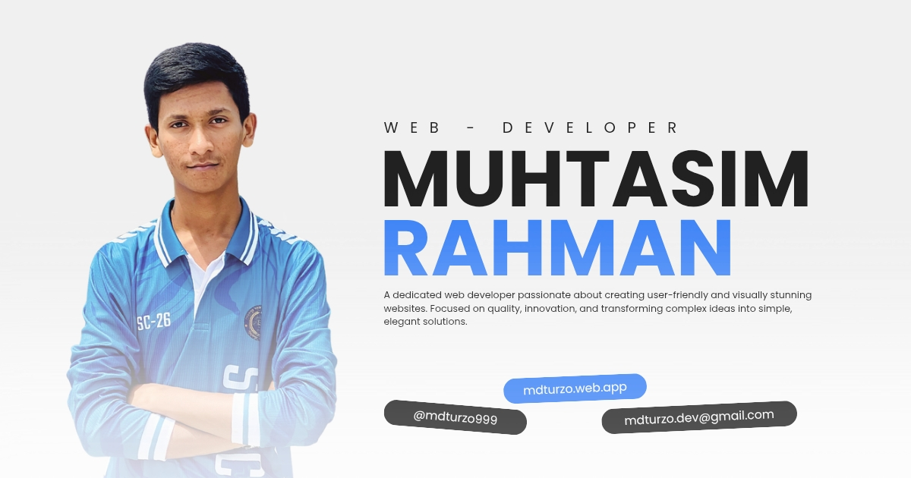

<!-- ════════════════════════════════════════════════════════════════════
     README.md  ·  github.com/muhtasim-rahman  ·  v2.0
     Muhtasim Rahman (Turzo) — Web Developer · Designer · Creator
     ════════════════════════════════════════════════════════════════════ -->

 

  
  &nbsp;
  
  &nbsp;
  
  &nbsp;
  

 

<!-- ═══════════════════════════  ABOUT  ═══════════════════════════ -->

<table>
  <tr>
    <td align="center" valign="top" width="38%">
       
      
        
      
      
      
       
      
      
      
       
      
      
      
    </td>
    <td valign="top" width="62%">
      <h2>👋 About Me</h2>
      

        A self-taught <strong>Web Developer &amp; Designer</strong> from <strong>🇧🇩 Nilphamari, Bangladesh</strong> — passionate about crafting clean, fast, and meaningful digital experiences.
      

      

        I started programming at ~16, teaching myself through online resources and building real-world projects with <strong>Firebase</strong>, <strong>PWA architecture</strong>, and <strong>GSAP animations</strong>. Currently an <strong>SSC-26</strong> student with a clear dream: become a <strong>CSE Engineer</strong> and full-stack developer.
      

      

        Quality and perfection are non-negotiable for me — every pixel, every line of code deserves its due attention.
      

       
      <table border="0">
        <tr>
          <td>🎓 <strong>Status</strong></td>
          <td>SSC-26 Batch · Aspiring CSE Student</td>
        </tr>
        <tr>
          <td>💼 <strong>Experience</strong></td>
          <td>3+ yrs Web Dev · 6+ yrs Design &amp; Editing</td>
        </tr>
        <tr>
          <td>🚀 <strong>Projects</strong></td>
          <td>19+ projects · PWA · Firebase · GSAP</td>
        </tr>
        <tr>
          <td>🌐 <strong>Portfolio</strong></td>
          <td><a href="https://mdturzo.web.app">mdturzo.web.app</a></td>
        </tr>
        <tr>
          <td>📧 <strong>Email</strong></td>
          <td><a href="mailto:mdturzo.dev@gmail.com">mdturzo.dev@gmail.com</a></td>
        </tr>
        <tr>
          <td>🕌 <strong>Values</strong></td>
          <td>Islamic ethics · Halal work · Honest craft</td>
        </tr>
      </table>
       
      
      &nbsp;
      
      &nbsp;
      
    </td>
  </tr>
</table>

 

<!-- ════════════════════════  TECH STACK  ════════════════════════ -->

<h2>⚡ Tech Stack &amp; Tools</h2>

 

<strong>Languages</strong>

 

<strong>Platforms &amp; Tools</strong>

 

&nbsp;

 

<!-- ══════════════════════  FEATURED PROJECTS  ══════════════════════ -->

## 🚀 Featured Projects

<table>
  <tr>
    <td valign="top" width="50%">
      <h3>🔗 Linkivo &nbsp;Smart Link Manager</h3>
      

        A sophisticated <strong>Progressive Web App</strong> for intelligent link management. Cinematic GSAP splash screen, Firebase realtime backend, weighted discovery algorithm, secure PIN auth with DOM-hiding, and a multi-layered website preview system.
      

      

        
        
        
        
      

      

        
      

    </td>
    <td valign="top" width="50%">
      <h3>📱 QR Prism &nbsp;QR Code Suite</h3>
      

        A full-featured <strong>PWA</strong> for QR code generation, scanning &amp; batch processing. Supports CSV/JSON import, ZIP export, camera scanner with overlay UI, SHA-256 admin auth, and 3-tier Service Worker caching.
      

      

        
        
        
        
      

      

        
      

    </td>
  </tr>
  <tr>
    <td valign="top" width="50%">
      <h3>📤 Exporter Pro &nbsp;Export Engine</h3>
      

        An open-source, zero-dependency <strong>JavaScript export engine</strong> with Shadow DOM isolation. Supports PNG, JPG, WebP, SVG, PDF &amp; CMYK — drop-in embeddable into any web project with zero style conflicts.
      

      

        
        
        
      

      

        
        &nbsp;
        
      

    </td>
    <td valign="top" width="50%">
      <h3>📊 UFMT-SSC26 &nbsp;Exam Rank Tracker</h3>
      

        A web app for tracking merit positions &amp; exam ranks for SSC-26 batch students. Uses <strong>Google Sheets as a live database</strong> — real-time sync, performance analytics, and custom ranking dashboards.
      

      

        
        
        
      

      

        
        &nbsp;
        
      

    </td>
  </tr>
</table>

   
  

 

<!-- ═══════════════════════  GITHUB STATS  ═══════════════════════ -->

<h2>📊 GitHub Analytics</h2>

 

&nbsp;&nbsp;

  

 

<!-- ═══════════════════════  CONNECT  ═══════════════════════ -->

<h2>🤝 Let's Connect</h2>

 

&nbsp;

&nbsp;

 

&nbsp;

&nbsp;

&nbsp;

 

&nbsp;

&nbsp;

  

<em>
  "A dedicated developer passionate about creating user-friendly and visually stunning websites. 
  Focused on quality, innovation, and transforming complex ideas into simple, elegant solutions."
</em>

 

<!-- ═══════════════════════  FOOTER  ═══════════════════════ -->

---

  Made with ❤️ by <a href="https://mdturzo.web.app">Muhtasim Rahman</a> &nbsp;·&nbsp; 🇧🇩 Bangladesh &nbsp;·&nbsp; 2026

