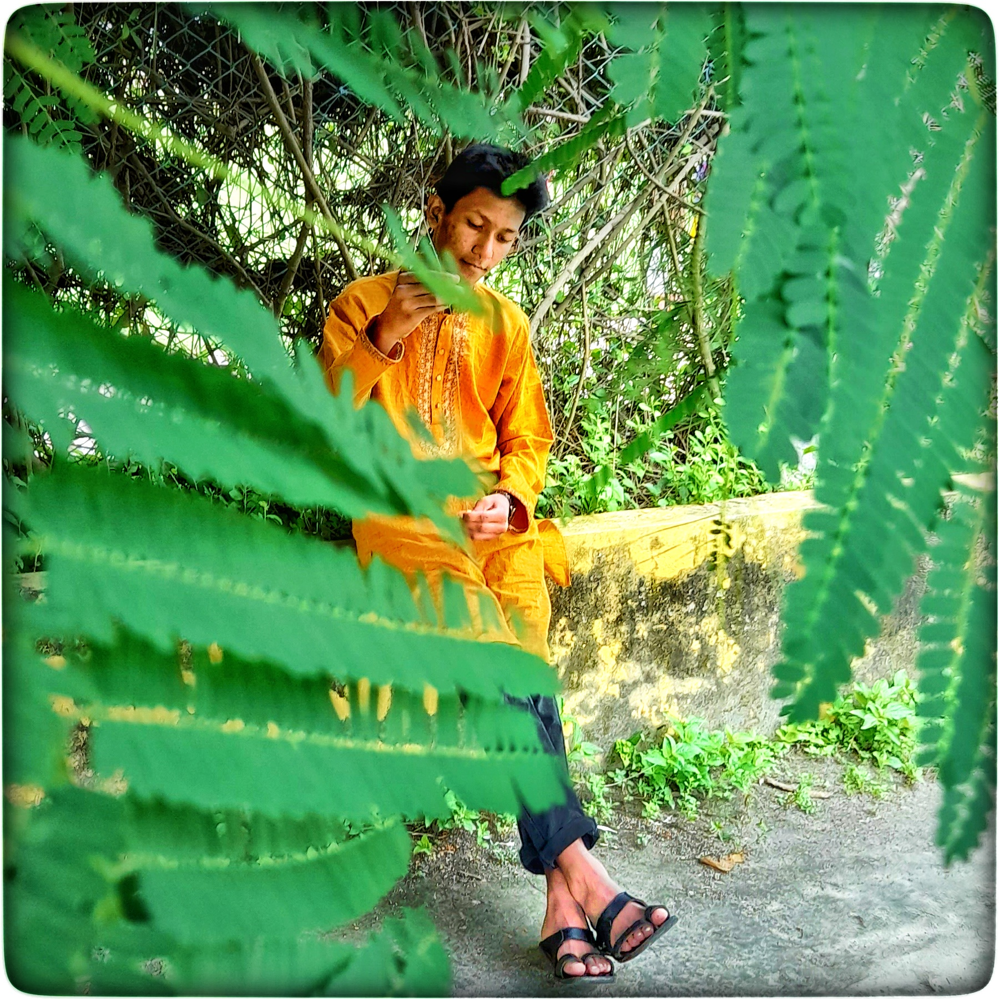

<!-- Banner starts -->

<h1> Assalamu Alikum </h1>

<h2> Muhtasim Rahman</h2>

_Student & Web Developer_

 
 
 
 

### About Me

 This is Turzo. My full name is 'Md Muhtasim Rahman Mahmud'. I am a student of Class 9 (2024) from Saidpur Govt. Science College, Saidpur Nilphamari. I am 16 years old. 

 From my childhood I like technical reletad things. I think I have enough Knowledge about mobile and computer according to my age. I wanted to be an electrical enginiar. But mow I have changed my decisation. Now I want to be a CSC Enginier. So I am learning programing from YouTube. 

### Skills

|                                                         | Languages    | Rating |
| ------------------------------------------------------- | ------------ | ------ |
|        | Java         | ★★☆☆☆  |
|      | Python       | ★★★☆☆  |
|        | HTML         | ★★★★☆  |
|         | CSS          | ★★★★☆  |
|   | Bootstrap    | ★★★☆☆  |
|  | JavaScript   | ★★☆☆☆  |
|         | Git & GitHub | ★★★★☆  |
