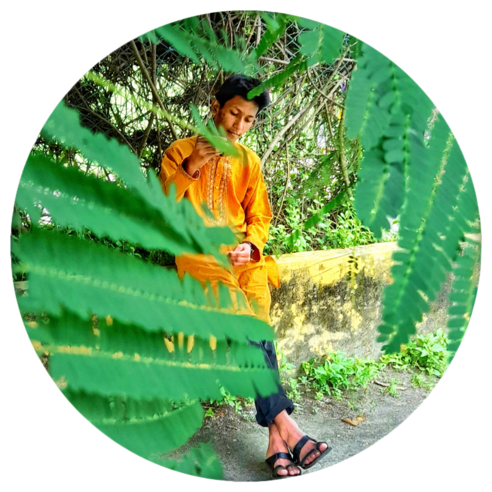

<!-- Banner starts -->

<h1> 🤝Assalamu Alikum </h1>

<h2> Muhtasim Rahman</h2>

_Student & Web Developer_

 
 
 
 

### 🙋‍♂️ About Me

 This is Turzo. My full name is 'Md Muhtasim Rahman Mahmud'. I am a student of Class 9 (2024) from Saidpur Govt. Science College, Saidpur Nilphamari. I am 16 years old. 

 From my childhood I like technical reletad things. I think I have enough Knowledge about mobile and computer according to my age. I wanted to be an electrical enginiar. But mow I have changed my decisation. Now I want to be a CSC Enginier. So I am learning programing from YouTube. 

 

### 👨🏻‍🎓 Education

1. St. Gerosa`s Junior School  
   <b>Class: </b><i>Nursery, Kagy, One, Two, Three</i>
2. Tulshiram Govt. Primary School  
   <b>Class: </b><i>Four, Five</i>
3. Saidpur Govt. Science College  
   <b>Class: </b><i>Six, Seven, Eight

- <b>PSC</b> pass  
  (From: <i>Tulshiram Govt. Primary School)</i>
- <b>Class 8</b> Pass  
  (From: <i>Saidpur Govt. Science College )
- <b>Now in class 9 (SGSC).</b>

 

### 🤹🏻 My Skills on Programming

|                                                         | Languages    | Rating |
| ------------------------------------------------------- | ------------ | ------ |
|        | Java         | ★★☆☆☆  |
|      | Python       | ★★★☆☆  |
|        | HTML         | ★★★★☆  |
|         | CSS          | ★★★★☆  |
|   | Bootstrap    | ★★★☆☆  |
|  | JavaScript   | ★★☆☆☆  |
|         | Git & GitHub | ★★★★☆  |

 

### 🌍 Language

- 🇧🇩 Bangla : Native
- 🏴󠁧󠁢󠁥󠁮󠁧󠁿 English : Advanced
- 🇮🇳 Hindi : Communicative

 

### Sports / Game / Activities / Hobby:

- 🤲 Prayer
- 👨🏻‍💻 Programming & codding
- 🏏 Cricket, ⚽ Football,
- 🏊‍♂️ Swimming, 🚴‍♀️ cycleing, 🚶‍♂️ Walking
- ✈️ Travelling

 

### Want a Profesitional Website?

 

### 🖥️ About my GitHub skills

  <!-- github stats starts here  -->

<!--  -->

 

<!-- github stats ends here  -->

---

Thank you for taking the time to check in on me.  
All rights reserved by <b> Muhtasim Rahman @2024.5 </b>

---
